COMMAND VALIDATOR Tool
========

Let's introduce how the command validator app works. 


## Start

1. Start from exe

Run .\dist\command_validator\command_validator.exe directly.

2. Start from Python

Install prerequisite modules first, including Pyside2, lxml, pandas.
**command_validator.py** is the main module. It defines all the events of pushbutton, combobox, dialog. 
Try to start UI from running this module. 

## Usage

### MainWindow

As you can see, the first UI interface contains 2 tab widgets, main and input.

*[Main]*

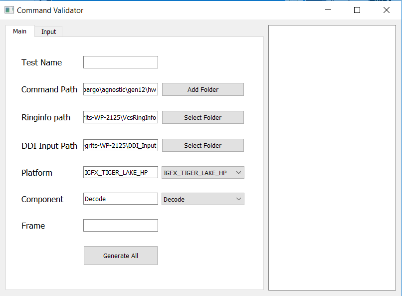

For each TextEdit field, users should satisfy certain requirements.
1. TestName 
- input testname like `encodeHevcCQ`
2. Command Path
- It should be the folder you store all the mhw_xxx.h files that you want to use.
For general search, you can choose `....\gfx\gfx-driver\Source\media` as your command path.
If you want to search specifically, click **Add Folder** button.

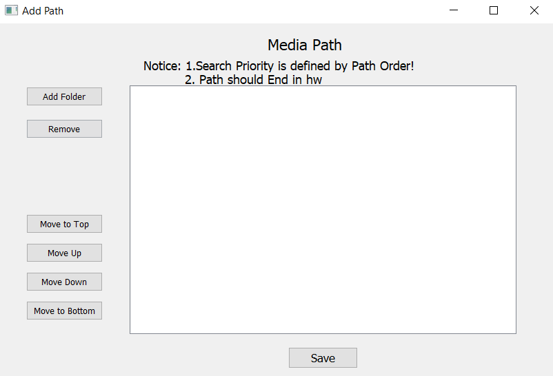

In this interface you can adjust search priority by folder order, but path need to end in hw(if you want
to add more than 1 folder). Don't forget to click save button before close this window.
The first folder will be used to generate base media path: `....\gfx\gfx-driver\Source`. We will use
base media path to generate your workspace(talk it later). Besides, we will add `...\media\media_embargo\agnostic\gen12\hw`
to the bottom of search list in case you forget to add it. This folder contains `mhw..._x.h` files.

3. Ringinfo path
- This path should contain vcsringinfo with name like `1-VcsRingInfo_0_0.txt`. The leading `1` 
means the first frame. But in the final result, we will make `0` as the first frame number. 

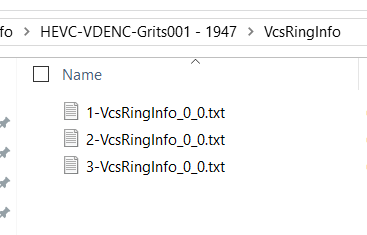

4. DDI input path
- This path should contain ddiinput with name like `0-0_1_DDIEnc_SlcParams_I_Frame.txt`.

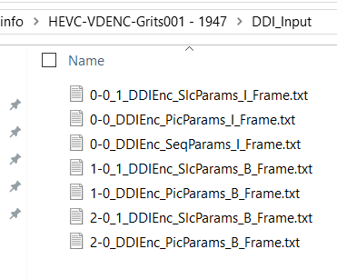

5. Platform

- read from `igfxfmid.h`. This doesn't really matter in my search logic because the platform 
name is not unified with cmd class name in mhw header. So while searching, I simply search class
name without `_x` first, then name with `_x`.

6. Component
- We have introduced how we find base media path. If you select `VP`, your workspace would be
`.....\Source\media\media_embargo\media_driver_next\ult\windows\vp\test\test_data`. Else, your workspace would 
be `.....\Source\media\media_embargo\media_driver_next\ult\windows\codec\test\test_data`. 
7. Frame
- Auto fill when you finish editing Ringinfo path

Click `Generate All` button, we will switch to the second tab widget: input.
We organize different testname infomation by seperate folders in your workspace. For example, if your
input tesname is `aaa`, then all the infomation related will be saved in `.....\test\test_data\aaa`.

*[input-new testname]*

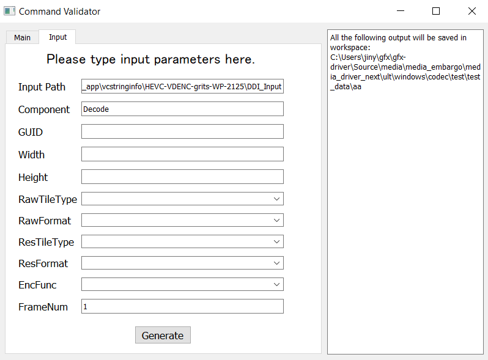

- The first 2 text fields(Input Path & Component) inherit from main widget. If this is a new tesname, you need to input the infomation
listed. If you need to rewrite a testname, this will load old configuration from files.

*[input-existed testname]*

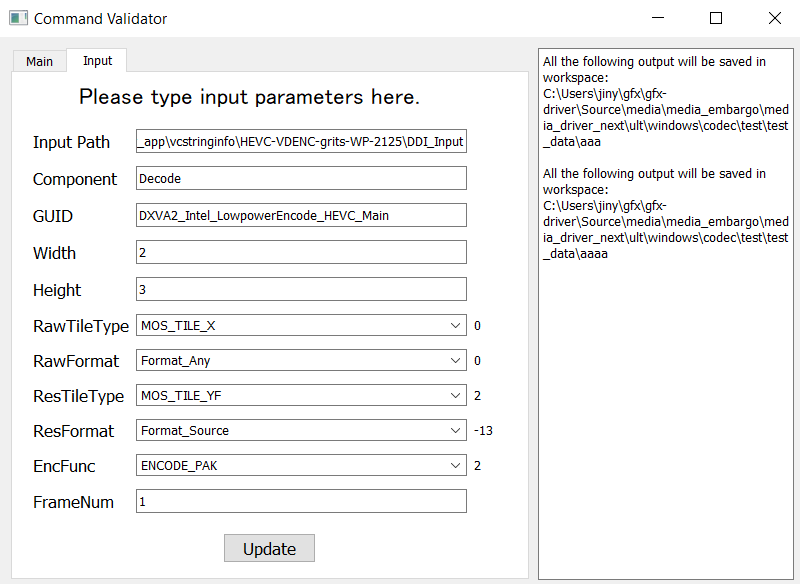

- GUID should be str, Width and Height should be int(Add 0x if you prefer to use int16).

As for next 5 comboboxes, **get_enum_member.py** script is written to load their dropdown lists. 
**extended_combobox.py** is written to reload default combobox, which can filter item by input text.

- RawTileType, ResTileType attributes load dropdown lists from  

`...\Source\media\media_driver\agnostic\common\os\mos_resource_defs.h`

		#typedef enum _MOS_TILE_TYPE
		#{
		#    MOS_TILE_X,
		#    MOS_TILE_Y,
		#    MOS_TILE_YF,            // 4KB tile
		#    MOS_TILE_YS,            // 64KB tile
		#    MOS_TILE_LINEAR,
		#    MOS_TILE_INVALID
		#} MOS_TILE_TYPE;

- RawFormat, ResFormat attributes also load dropdown lists from  

`...\Source\media\media_driver\agnostic\common\os\mos_resource_defs.h`

		#typedef enum _MOS_FORMAT
		#{
		#   ...
		#   Format_NV12     ,
		#   ...
		#   Format_Buffer      ,
		#   ...
		#} MOS_FORMAT, *PMOS_FORMAT;

- EncFunc attribute loads dropdown lists from  

`...\Source\media\media_embargo\windows\common\codec\ddi\d3d9\dxvaencode_lh.h`

		#typedef enum tagENCODE_FUNC
		#{
		#    ENCODE_ENC          = 0x0001,
		#    ENCODE_PAK          = 0x0002,
		#    ENCODE_ENC_PAK      = 0x0004,
		#    ENCODE_HYBRIDPAK    = 0x0008,
		#    ENCODE_WIDI         = 0x8000
		#} ENCODE_FUNC;

- FrameNum is autofilled when you finish editing ddiinputpath in the main widget.

Then, click `Generate` or `Update` button. This step includes several oprations.
1. Firstly, combine all the DDIinput files in the path and 
your configuration in a new file (Name rule: TestName+Input.dat) in your workspace. 

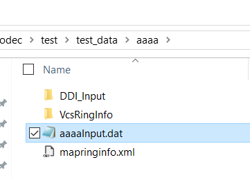
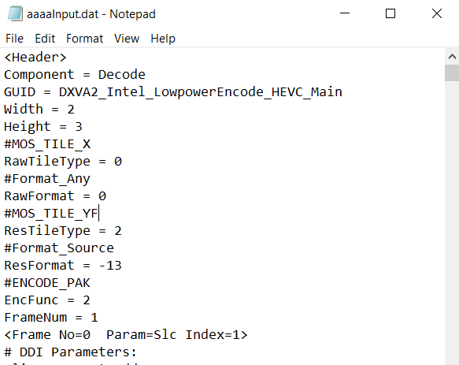

2. Secondly, update the following files automatically.  

   ```
   ...\Source\media\media_embargo\utlt\windows\codec\test\encode_integrated_test.cpp
   ...\Source\media\media_embargo\utlt\windows\codec\test\encode_integrated_test_cfg.cpp
   ...\Source\media\media_embargo\utlt\windows\codec\test\test_data\resource.h
   ...\Source\media\media_embargo\utlt\windows\codec\test\test_data\media_driver_codec_ult.rc
   ```

   

3. Also, start parsing cmd and related value in vcsringinfo files. Pop up commandinfo window 
  when finished. 

### FormCommandInfo

*[CMD list]*

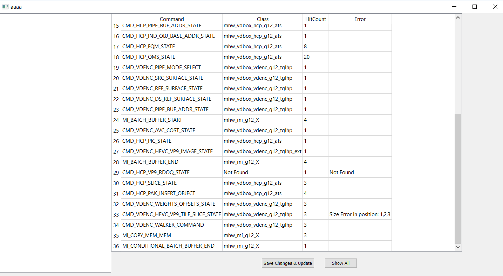

We give this cmd list to let users know whether there is any error in search process and 
in which class we find this cmd. As you can see in the image, we identify not found and size error.

- Size error means dword size isn't satisfy size rules: DW0_dwlength == Input_dwsize - 2, define_dwsize <=
Input_dwsize.Exceptions:

1. If DW0_dwlength doesn't exist, skip it.
2. If input_dwsize == 0/1, DW0_dwlength == 0
3. If cmd is `MI_STORE_DATA_IMM` or `MI_FLUSH_DW`, ignore its dwsize error. If `MI_NOOP` is its next cmd,
append `MI_NOOP` value to its last dword and delete this `MI_NOOP`.

DW0_dwlength:


input_dwsize:
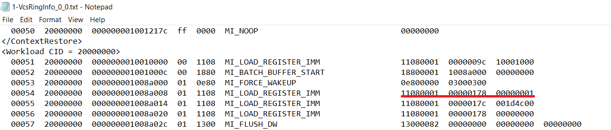
input_dwsize for `MI_LOAD_REGISTER_IMM` is 3

define_dwsize:

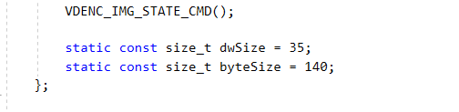

Besides, we also try to spot bitfield error in mhw. Like, : `__CODEGEN_BITFIELD(29, 32)` or bitfield overlap.
Currently, we do not find any:D


### Change cmd name or index

Double click cmd name or hitcount to modify it. You can modify any cmd in this list whether it reports error.
Type the new CMD name in the dialog.

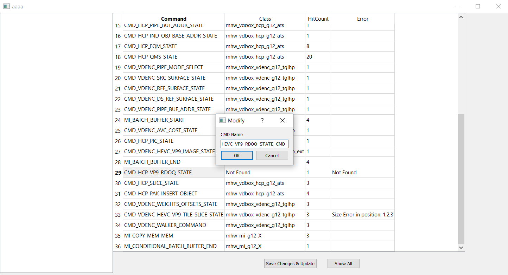
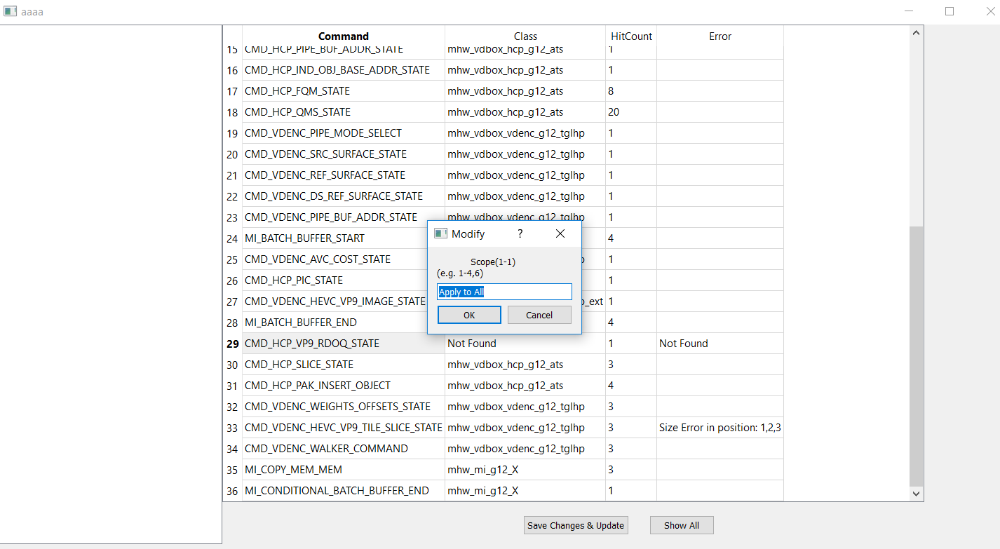

Default setting of change scope is `Apply to All`. If you would like to change specific cmd in the sequence,
you can give the index like `1-4, 6` if the total hitcount is 7.

After finishing modifying, click `Save Changes & Update`. Wait till the Success window pops up.
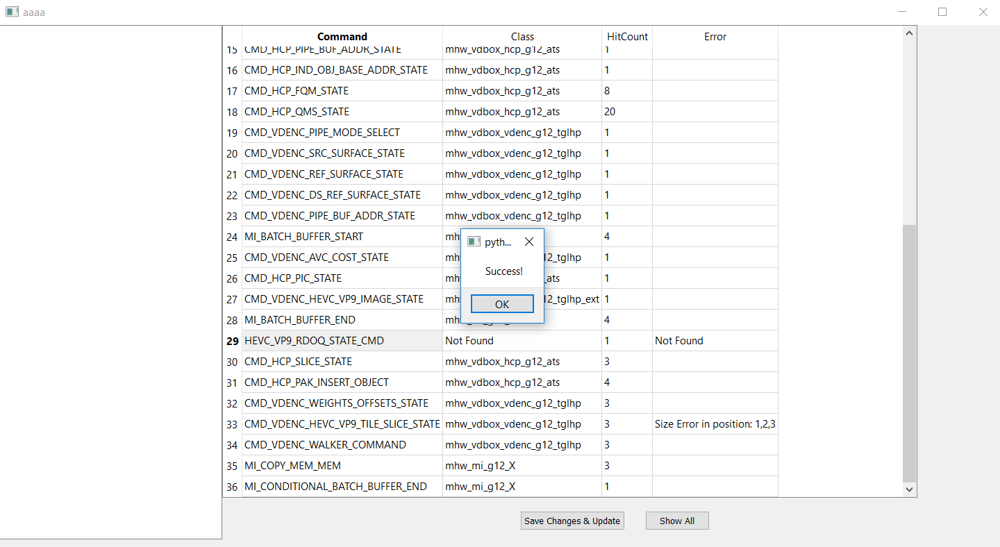

You can see the last modified CMD at the end of the list. (The true sequence of CMD would not change.)
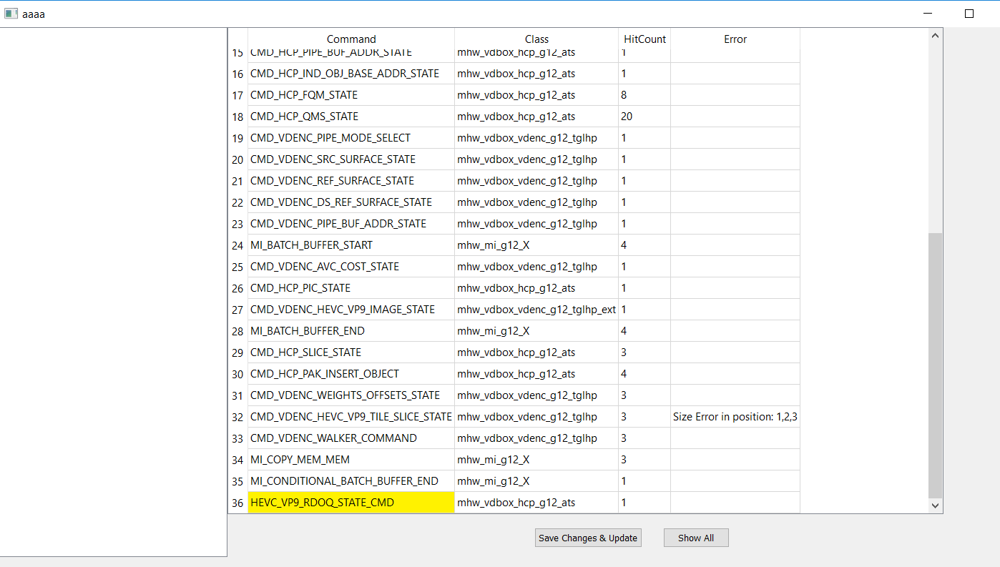

Click `Show All` to view the entire CMD validation form in details.

### Entire CMD validation form

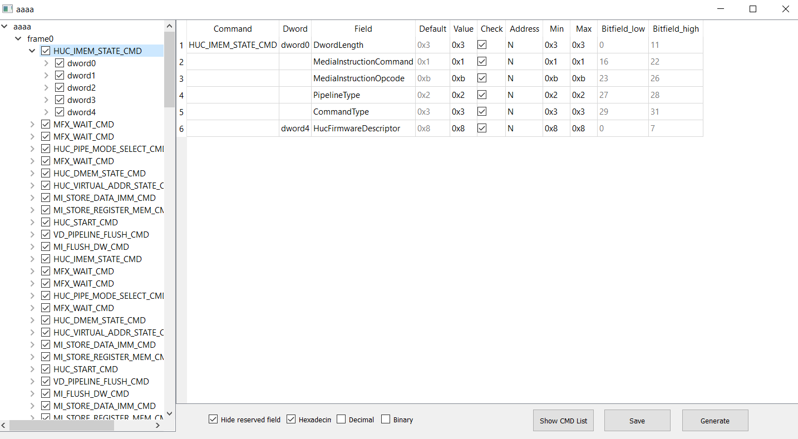

**@Qichen**

Features:
1. Check or uncheck a cmd or a dword on the left tree, or a field on the right table.
2. Double click the value to change it.
3. The tool will auto save the change in current form when changing the showing command.
4. Deselect `Hide reserved field` to view the hidden reserved field

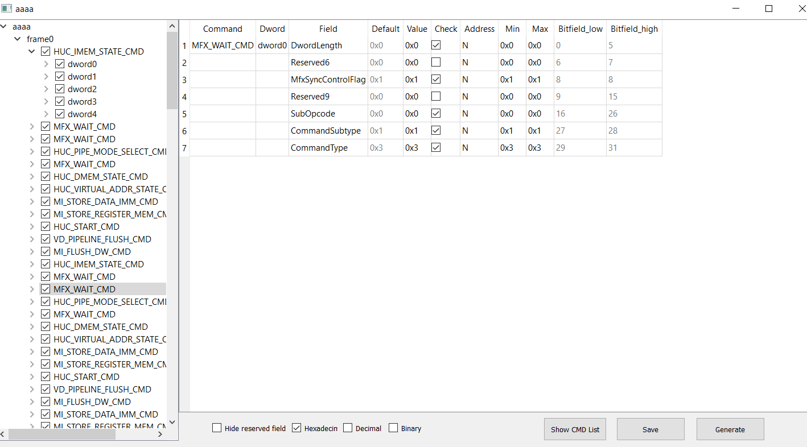

4. View the value in hexadecimal, or in decimal, or in binary.
5. `save` and `generate` the updated configuration xml in your workspace for future reference:
  `....\test\test_data\TestName\TestName_reference.xml` 

Package issue
-------
PyInstaller can bundle a Python application and all its dependencies into a single package. 
Users then can run the packaged app without installing a Python interpreter or any modules. Now PyInstaller
works fine with this tool.

Ref: https://pythonhosted.org/PyInstaller/usage.html

1. After installing PyInstaller successfully, set your current directory to .\Client\command_validator_app\,
2. run command `pyinstaller command_validator.py`. See carefully if there reports any error, try to fix it.
For example, if pyinstaller says `ModuleNotFoundError: No module named 'win32com'`, then use `pip install pypiwin32`
to install the missing module.
3. If things go smoothly, you could run .\dist\command_validator.exe directly.
4. PyInstaller also supports to create a one-file bundled executable. 
Use command `pyinstaller -F --name="command_validator" command_validator.py`. It is not recommended for debugging,
but might be used for the final version.

Brief introduction of Core Scripts logic
-------

## header_parser.py

Convert mhw header files to xml. Comments and predefinion would be discarded. Other parts would follow the
same layer as the header files. Contents that are unable to parse would be save in unparsedtext node.
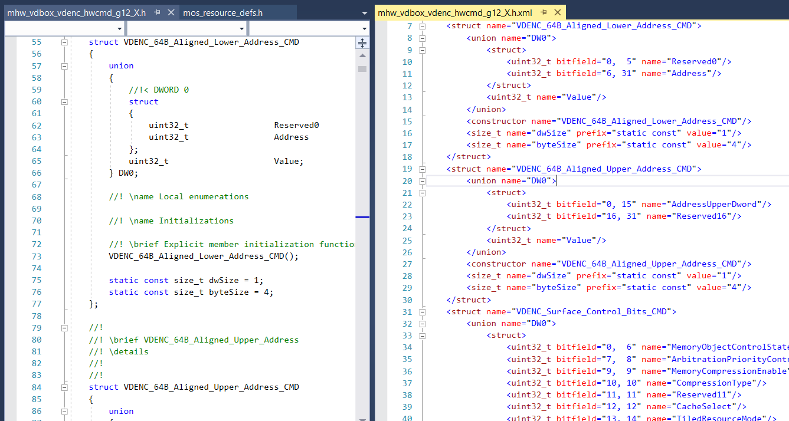

## cmdfinder.py

After parsing all the mhw header files using **header_parser.py**, now we can locate vcsringinfo cmd in
mhw and map their dword values. 
1. Use pandas(Python Data Analysis Library) to extract vcsringinfo infomation to pandas dataframe.
2. cmd names in vcsringinfo and mhw header files are often different. Like, in ringcmdinfo "CMD_SFC_STATE_OBJECT"
but in header file "SFC_STATE_CMD". So the match logic is : split the name str into a list, ['CMD', 'SFC', 'STATE', 'OBJECT'].
Ignore keywords ['CMD', 'COMMAND', 'OBJECT', 'MEDIA', 'STATE'] if they appear in either cmd name list. Equal keywords
[['_ON_OFF','_CHECK'],['VEB','VEBOX'],['COST','COSTS'],['QMS','QM'],['IMAGE','IMG'],['WEIGHTSOFFSETS','WEIGHTS_OFFSETS']]
if those pairs appear in either cmd name list. Finally, judge their match result.
3. If cmd matches, map dword value in corresponding field. If some cmd struct is used in another cmd, we will 
expand it as a dword.
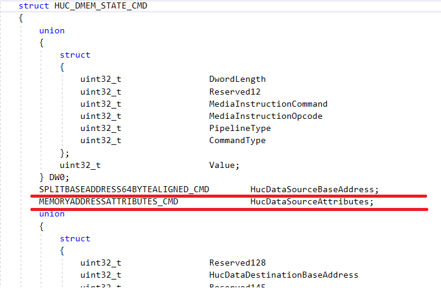
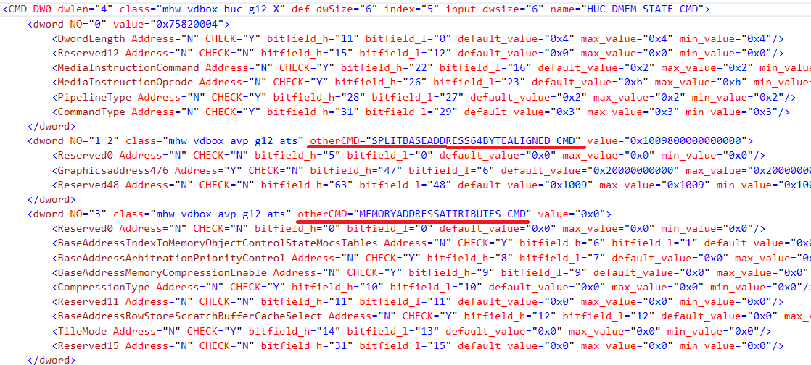
while searching, first search in memory, which means the previous search result, because lots of cmds 
are duplicates. If found in memory, copy the whole node, update its value and append the node to result;
If not found, repeat the above search process in all mhw files.
4. Check if any dword duplicates or losts. Check size error, not found error, and bitfield error(explained before).
5. Update results if users modify some cmd in cmd list UI.

## command_validator.py

Draw the UI, display cmdfinder results. Our module is based on Pyside2 library. If you would like to change the UI, please refer
to the pyside2 official guide.

**ui_command_info.py, ui_mainwindow.py, ui_Addpath.py** is generated from xxx.ui files(Use qt creator to edit them) 
by pyside2-uic commmand. 

Other scripts you may need in the future
-------

## mvfiles.py

### countlines

count lines all the mhw header files  in desirable folder

### cpfiles

copy a batch of files to a batch of target locations

### clrfiles

clear files created in the previous opration

## ElementTree_pretty.py

pretty print XML elemt with indent


       <class name="mhw_vdbox_vdenc_g12_X">
           <public>

## webgenxml.py

Extract cmd infomation from bspec, and save into xml.

## cpp_parser.py

Convert mhw cpp files to xml
